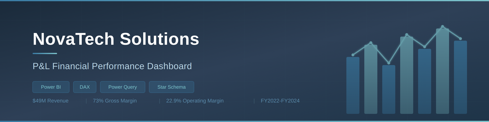
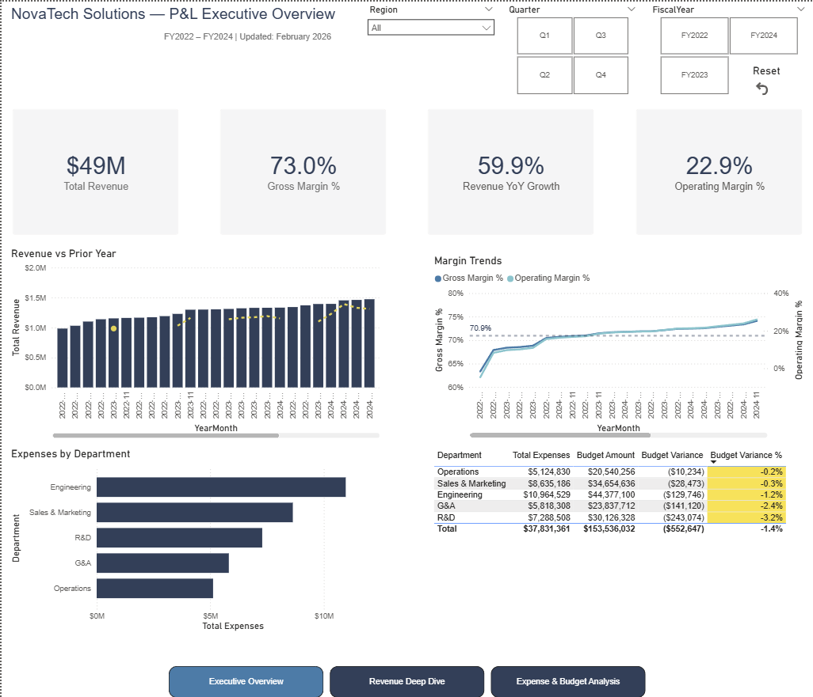
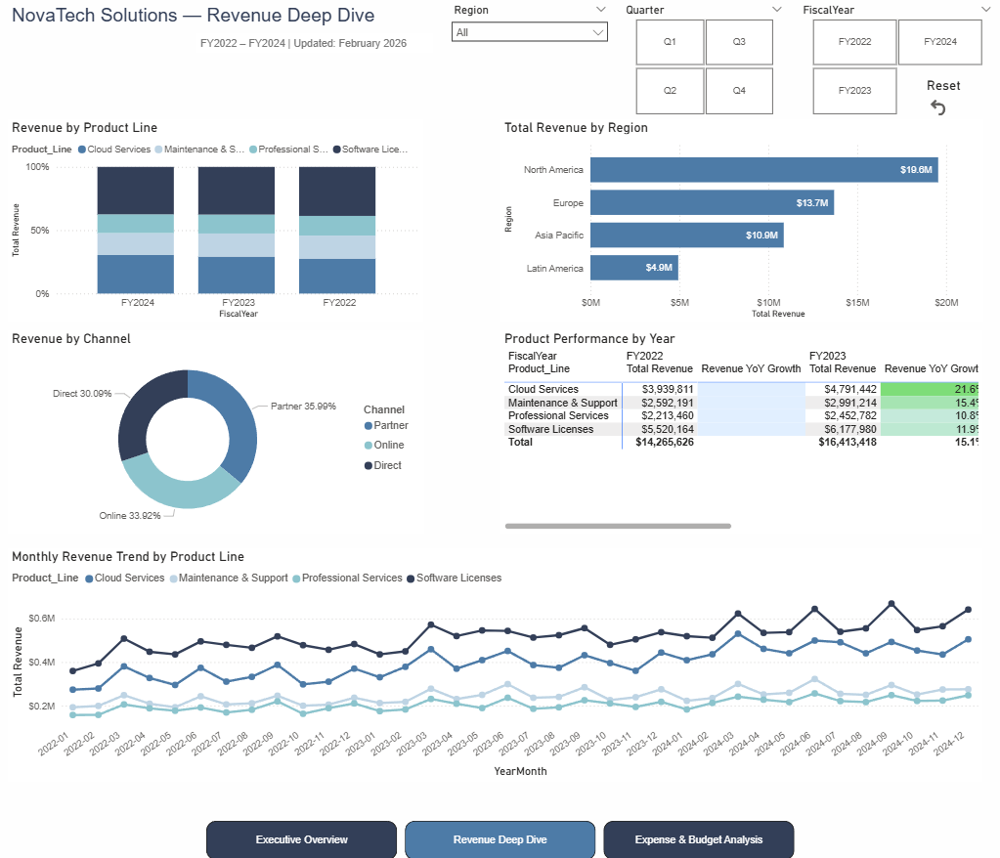
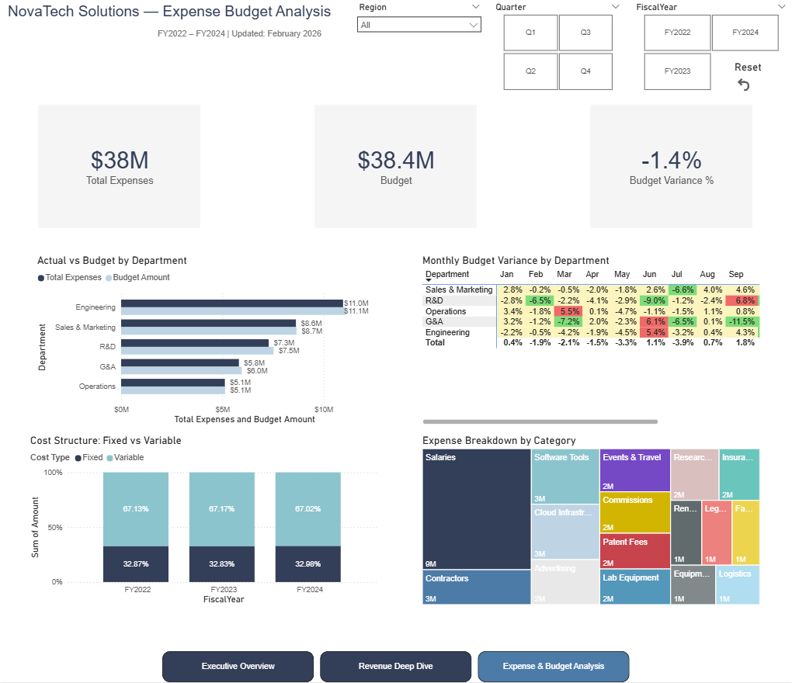

<p align="center">
  
</p>

<h1 align="center">NovaTech Solutions — P&L Financial Performance Dashboard</h1>

<p align="center">
  <strong>An end-to-end Power BI project analyzing $49M in revenue across 4 product lines, 4 regions, and 36 months.</strong>
</p>

<p align="center">
  
  
  
  
  
</p>

---

## About This Project

NovaTech Solutions is a fictional mid-market SaaS company. The finance team relied on static Excel reports that took 2+ days to compile each month-end close. This dashboard replaces that workflow with an interactive, self-service P&L analysis tool designed for the CFO and FP&A team.

The project covers the full analytics lifecycle: raw data ingestion, Power Query transformations, star schema modeling, DAX measures, dashboard design, and business storytelling.

---

## Dashboard Preview

### Executive Overview
> KPI cards, revenue vs prior year, margin trends, expense breakdown, budget variance table

<p align="center">
  
</p>

### Revenue Deep Dive
> Product mix, regional comparison, channel split, YoY growth matrix, monthly trend

<p align="center">
  
</p>

### Expense & Budget Analysis
> Actual vs budget, variance heatmap, fixed/variable cost structure, category treemap

<p align="center">
  
</p>

---

## Key Findings

| Finding | Detail | Recommendation |
|:--------|:-------|:---------------|
| **Cloud Services leads growth** | ~20% CAGR vs 12% company-wide; share rose from 27% to 32% | Shift sales incentives toward cloud upselling |
| **Strong quarterly seasonality** | Quarter-end months show 15-20% revenue lift; Jan/Feb weakest | Align campaigns and hiring to Q4 close cycles |
| **Budget discipline is solid** | -1.4% total variance; pockets of R&D overrun at 6-9% | Implement rolling forecast adjustments for R&D |
| **LATAM discounts compress margin** | 10-12% avg discount vs 6-8% in NA/Europe | Review regional pricing and partner terms |
| **Stable cost structure** | 67% fixed / 33% variable, consistent across all 3 years | Revenue growth should flow to operating income predictably |

---

## Data Model

```
                    ┌──────────────┐
                    │  DateTable   │
                    │  (Calendar)  │
                    └──────┬───────┘
                           │
              ┌────────────┼────────────┐
              │            │            │
       ┌──────▼─────┐ ┌───▼────┐ ┌────▼─────┐
       │  Revenue    │ │Expenses│ │  Budget   │
       │  (Fact)     │ │ (Fact) │ │  (Ref)   │
       │  ~5,760 rows│ │~3,600  │ │  ~180    │
       └─────────────┘ └────────┘ └──────────┘

       ┌─────────────────┐  ┌──────────────┐
       │Chart_of_Accounts│  │ KPI_Targets  │
       │  (Dimension)    │  │  (Reference) │
       └─────────────────┘  └──────────────┘
```

All relationships use **single-direction, one-to-many** cardinality from DateTable to fact tables.

---

## Technical Stack

### ETL (Power Query)
- Type casting and column validation across all source tables
- Gross Revenue derivation: `Revenue / (1 - Discount_Pct)`
- Fiscal period columns (Quarter, Year) via M formulas
- Left outer join: Expenses merged with Budget on Year + Month + Department
- Conditional column: `Is_Fixed` mapped to `Fixed` / `Variable` labels

### DAX Measures (15 total)
```dax
-- Time Intelligence
Revenue PY = CALCULATE([Total Revenue], SAMEPERIODLASTYEAR(DateTable[Date]))
Revenue YoY Growth = DIVIDE([Total Revenue] - [Revenue PY], [Revenue PY])

-- Budget (virtual relationship via TREATAS)
Budget Amount v2 = 
    CALCULATE(SUM(Budget[Budget_Amount]),
        TREATAS(VALUES(Expenses[Department]), Budget[Department]),
        TREATAS(VALUES(DateTable[Year]), Budget[Year]),
        TREATAS(VALUES(DateTable[Month]), Budget[Month]))

-- Variance
Budget Variance % = DIVIDE([Total Expenses] - [Budget Amount v2], [Budget Amount v2], 0)
Variance Status = SWITCH(TRUE(),
    [Budget Variance %] > 0.05, "Over Budget",
    [Budget Variance %] < -0.05, "Under Budget",
    "On Track")
```

### Dashboard Features
- Synced slicers (Year, Quarter, Region) across all pages
- Conditional formatting: red/yellow/green budget heatmap, white-to-green YoY growth
- Navigation buttons with page actions
- Reset Filters button
- Consistent 4-color palette: `#2E4057` `#3A7CA5` `#7DC4CC` `#B8D4E3`

---

## Repository Structure

```
novatech-pnl-dashboard/
├── README.md
├── data/
│   └── NovaTech_PnL_Dataset.xlsx
├── dashboard/
│   └── NovaTech_PnL_Dashboard.pbix
├── screenshots/
│   ├── banner.png
│   ├── 01_executive_overview.png
│   ├── 02_revenue_deep_dive.png
│   └── 03_expense_budget.png
└── docs/
    └── NovaTech_Portfolio_Writeup.docx
```

---

## How to Use

1. Clone or download this repository
2. Open `NovaTech_PnL_Dashboard.pbix` in [Power BI Desktop](https://powerbi.microsoft.com/desktop/)
3. If prompted, update the data source path to point to `data/NovaTech_PnL_Dataset.xlsx`
4. Refresh the data and explore

---

## Potential Extensions

- **Row-Level Security** — restrict regional managers to their own data
- **What-If Parameters** — revenue growth scenario slider for dynamic projections
- **Paginated Reports** — pixel-perfect P&L statement for board distribution
- **Incremental Refresh** — production deployment configuration for Power BI Service
- **Mobile Layout** — optimized view for executive mobile consumption

---

<p align="center">
  <strong>Built by Harsh Kakroo</strong><br/>
</p>
